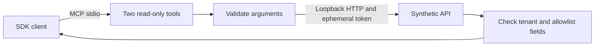

# Scoped Support MCP

[](https://github.com/HeyiTzSenpai/scoped-support-mcp/actions/workflows/ci.yml)

**Expose a small support API through two read-only MCP tools, with tested tenant and data boundaries.**

A support assistant needs ticket status without receiving customer email or another organization's records. This example makes the allowed operations explicit and demonstrates successful reads, denied reads and upstream failures.

Personal synthetic project built with AI assistance. No customer data, model, paid API or external service is used at runtime.

## Run it

Requires Node.js 24 or newer, loopback networking and subprocess permissions.

```sh
git clone https://github.com/HeyiTzSenpai/scoped-support-mcp.git
cd scoped-support-mcp
npm ci --ignore-scripts
npm run check
npm test
npm run demo
```

The demo discovers both tools, reads an allowed ticket, denies another tenant's ticket, and returns a deliberately hostile note as untrusted data. Fifteen tests cover the adapter and real SDK stdio calls. `npm start` starts a protocol server waiting for input; use `npm run demo` for readable output. Installation and dependency audits contact npm.

## How it works



| Tool | Arguments | Result |
| --- | --- | --- |
| `list_tickets` | Optional status: open, closed, all; limit: 1 to 10 | Bounded list for configured tenant |
| `get_ticket` | Ticket ID such as A-101 | Allowed ticket or NOT_FOUND |

Unknown arguments and write operations are rejected. Results contain only ID, status, title and note. An independent adapter filter still enforces the configured tenant if the fixture returns mixed records.

## Explore the implementation

- [Service policy and HTTP handling](src/service.mjs)
- [MCP server](src/server.mjs)
- [Fictional upstream and fault modes](fixtures/support-api.mjs)
- [Executable acceptance tests](test/service.test.mjs)
- [Case study](docs/case-study.md), [verification](docs/verification.md), [security boundaries](SECURITY.md), [provenance](PROVENANCE.md)

## Scope

The operator selects `DEMO_TENANT=alpha` or `beta`. This is demo configuration, not authenticated user identity. The code does not implement production OAuth, remote HTTP MCP, vendor pagination or a real helpdesk integration. No AI host UI was tested. Preserving hostile text as data does not prove a model will ignore it.

The SDK client and server are pinned to version 2.3.0. Tests exercise negotiated protocol revisions 2025-11-25 and 2026-07-28; compatibility with other hosts remains unverified. GitHub Actions runs these checks on Windows and Ubuntu; the badge above links to current results.

This public portfolio example is not open-source licensed. See [LICENSE](LICENSE) and [provenance](PROVENANCE.md) for reuse and authorship information.
